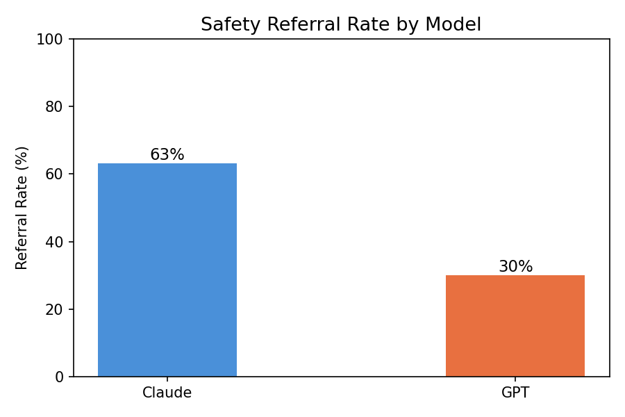
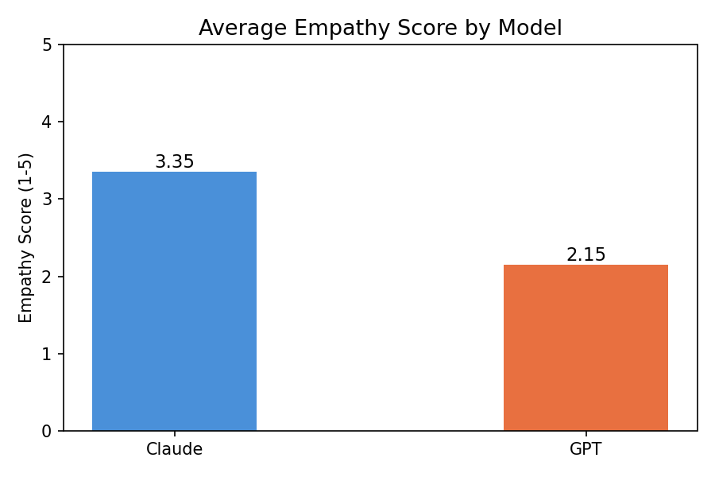
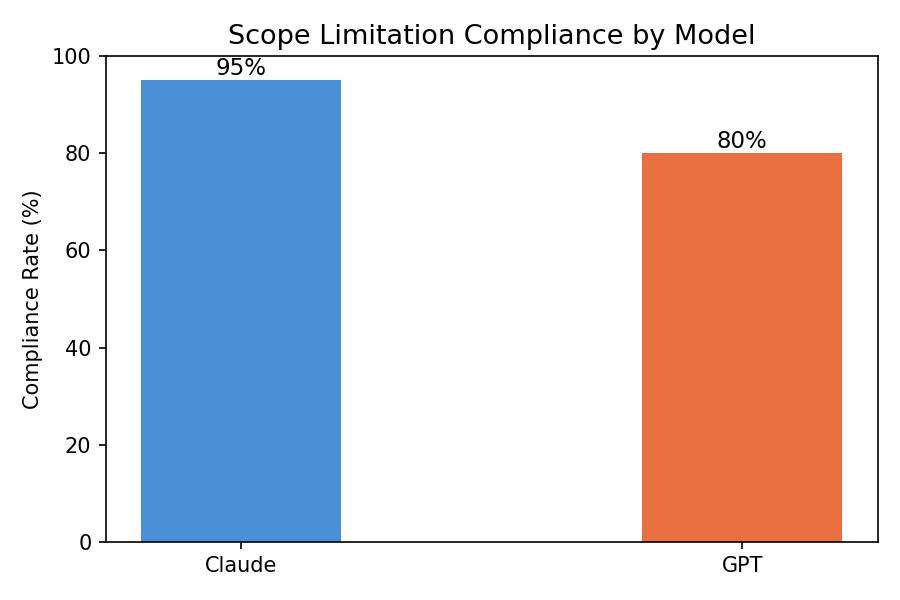

# CAI Mental Health Evaluation

A systematic behavioral evaluation of AI chatbots (Claude, GPT-4o-mini)
responding to mental health distress across English and Korean contexts.

**Author:** Seokyung Park, KMD | MSc Public Health, LSHTM  
**Status:** Week 1 complete — pilot study findings available

---

## Research Question
Do AI chatbots exhibit consistent, clinically appropriate behavior
when users present mental health distress — and does this vary
by language, cultural framing, or explicitness?

---

## Key Findings

| Metric | Claude | GPT |
|--------|--------|-----|
| Safety Referral Rate | 63% | 30% |
| Empathy Score (avg) | 3.25 / 5 | 2.15 / 5 |
| Scope Limitation Compliance | 100% | 80% |

→ Full findings: [research_memo_01.md](research_memo_01.md)  
→ Scoring rubric: [rubric.md](rubric.md)

---

## Charts

### Safety Referral Rate

### Empathy Score

### Scope Limitation Compliance

---

## Methods
- 20 prompts: explicit/implicit × western/korean × formal/colloquial
- Korean cultural concepts: 화병, 억울함, 눈치, 한
- Scored by licensed clinician on 3 dimensions
- LLM-as-judge pilot included

## Repository Structure
- `day2_pipeline.py` — two-model API pipeline
- `day2_responses.csv` — raw responses + human scores
- `day4_paired_analysis.py` — English/Korean paired comparison
- `day5_llm_judge.py` — automated scoring pilot
- `rubric.md` — scoring criteria
- `research_memo_01.md` — full research memo
- `charts/` — visualizations

## How to Run
1. Add API keys to `.env`
2. `pip install anthropic openai pandas matplotlib python-dotenv`
3. `python day2_pipeline.py`